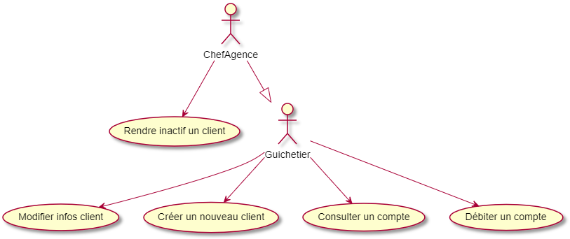
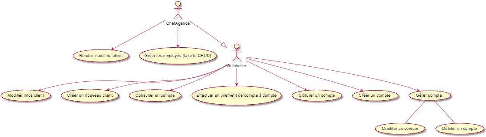

:toc:
:toc-placement!:
:toc-title: Table des matières

image::/images/DailyBank.png[]
= DailyBank - CDCU Version 0
_Réalisé par THOMPSON Victor, YVELIN Louis, SACILOTTO Nicolas et FERNANDEZ Mickael (4A)_

*Nom du projet : DailyBank* +
*Clients : Adhérents de la banque* +
*Date de livraison : 03/04/22*

*MàJ : 22/05/2022* +
*Groupe : 4A02* +

toc::[]

:sectnums:
== Contexte 

La banque DailyBank souhaite développer une application JAVA-Oracle de gestion des comptes clients pour remplacer plusieurs outils obsolètes. Ce développement s’inscrit dans le cadre de la restructuration de ses services bancaires et l’application sera déployée dans les 100 agences que compte son réseau. Nous travaillerons à partir d’une application existante « Daily Bank » qu’il faudra adapter aux nouveaux besoins de la banque.

== Description de l'application
L’application permet de gérer des comptes bancaires de dépôt pour des clients préalablement créés. Elle permet de débiter, créditer un compte soit par virement c’est-à-dire un échange d’argent entre deux comptes distincts mais domiciliés dans le réseau bancaire, soit par une personne physique se présentant devant un guichet.

== Objectif

L’application doit permettre de gérer des comptes bancaires de dépôt pour des clients préalablement créés. Elle devra permettre de débiter, créditer un compte soit par virement c’est-à-dire un échange d’argent entre deux comptes distincts mais domiciliés dans le réseau bancaire, soit par une personne physique se présentant devant un guichet.

== Analyse de l'existant (UC V0)

En ce qui concerne le lancement de notre projet nous avions à notre disposition ce diagramme des cas d'utilisations suivant :

Le guichetier hérite du chef d'agence : il pourra ainsi rendre inactif un client en plus de ces propres fonctions et de l'accueil des clients.

Il nous est fourni une application avec comme existant les fonctions principales.

Nous remarquons qu'il y a deux acteurs dans ce diagramme des UC :

-> Le chef d'agence qui s'occupe principalement du côté gestion de l'agence, il occupe une unique tâche : rendre inactif un client, celle-ci peut s'interprêter de deux manières. D'une part, le client peut s'être fait volé ses informations confidentielles comme son numéro de compte, numéro de cartes, mais aussi des objets physique, tels qu'une carte bancaire, carnet de chêque etc. Dans ce cas là, le client peut mais doit appeler sa banque pour mettre son compe en état de protection, pour ce faire, la banque rend le compte inactif pour limiter les dépenses des voleurs d'informations.

D'autre part, un client qui ne donne pas signe de vie depuis plus de douze mois, se verra dans un premier temps averti par l'agence bancaire, si le silence perdure alors le chef d'agence enclenchera une phase de limitation des frais sur le compte, puis en découlera une phase finale de transfert du compte de la personne vers un compte depôt.

-> Le guichetier est plus proche des clients, car il occupe principalement deux tâches, analyser leur(s) besoin(s), et y répondre au mieux.
Il peut sous réclamation du client, modifier ses informations (numéro de téléphone, adresse mail etc.), consulter son compte, débiter son compte, créer son nouveau compte.

== Contraintes

De nos jours, il est primordial d’approuver que les applications constituent un important critère du e-commerce ou en général, du marché virtuel.
Pour autant, au lancement d’une application sur un marché évolutif et virtuel, il est imposé aux créateurs de respecter de nombreuses contraintes, tant juridiques que techniques.

=== Juridiques 

Pour évoquer les contraintes juridiques, il est nécessaire de mentionner la présence des mentions légales de l’application. Cela permet à l’utilisateur de l’application de connaître d’une manière brève, le développeur de l’application et donc, de pouvoir bénéficier des coordonnées de celui-ci. 
Ainsi, le client sait de qui provient l’application, et peut se sentir rassuré sur la validité et la légalité de l’application. 
Sur ces mentions légales, doivent être indiquées des informations essentielles comme le numéro de téléphone, l’adresse, le nom des fondateurs de l’application ou encore les spécifications techniques garantissant un accès libre et sans restrictions d’utilisation aux clients. 
Par ailleurs, ces mentions légales permettent aux éditeurs de l’application de pouvoir bénéficier de la protection de la marque, des logiciels ou d’éventuel(s) logo(s) utilisé(s). 

Il est également important de mentionner le traitement des données personnelles de l’utilisateur. Celui-ci doit connaître de quelles manières sont gérées et utilisées ses propres données au sein de l’application mais également des droits d’accès et d’opposition dont il peut profiter. 
Cela passe par une confirmation des conditions générales de l’utilisateur ou tout simplement d’une information sur l’usage des données personnelles, adressée au client et dont il doit accepter. 
Toutefois, l’éditeur de l’application ne doit pas se contenter de faire valider ces conditions : il doit, en règle générale, demander une autorisation à la CNIL afin d’obtenir le droit du traitement et de la collection des informations personnelles d’un utilisateur, garantissant ainsi la loyauté et la licéité du traitement des données.

Enfin, la gestion des risques opérationnels constitue un élément majeur au sein des contraintes juridiques et subsiste comme une préoccupation majeure pour les banques. Celles-ci doivent garantir la fermeté et le maintien des procédures internes, des systèmes internes ou encore du personnel. 
Dans le cas de défaillances constatées dans ces critères, de pertes bancaires conséquentes ou encore d’une non-conformité de certaines procédures, l’entreprise peut recourir à des conséquences dramatiques notamment de nombreuses plaintes déposées à l’encontre de la société : ce sont des litiges. 
Il est indispensable aux fondateurs, de limiter ce type de risques, qu’ils puissent être des fautes professionnelles ou encore des accidents, sous peine de risquer les différentes relations commerciales entretenues par l’entreprise, la réputation de celle-ci ou encore l'exigence des ressources dans un temps limité.

=== Techniques

Pour autant, un créateur d’application ne doit pas uniquement se bloquer au respect des contraintes juridiques bien qu’elles soient importantes : il doit également accepter des contraintes techniques.

Premièrement, à l’utilisation de l’application, celle-ci doit être disponible. Concrètement, n’importe quel utilisateur recherchant une application de gestion de compte client puisse la trouver, en bénéficier et l’utiliser, quel que soit le client, où qu’il se situe et quand il le souhaite. 

Vient ensuite la convivialité et la simplicité d’utilisation de l’application. L’application doit être constituée d’une interface simple, épurée et conviviale afin que l’utilisateur puisse l’utiliser de manière sereine, sans difficultés de navigation. 
Celle-ci doit donner une bonne impression et le client doit ainsi pouvoir utiliser et trouver les fonctionnalités de l’application rapidement et facilement. La convivialité est un critère important puisqu’il constitue le premier contact entre l’utilisation et l’application. 
L’esthétique doit pouvoir se démarquer des autres applications, en essayant de toujours proposer quelque chose de nouveau, d’innovant et de créatif.

L’application doit proposer des solutions ouvertes et évoluées tout en étant apte à être améliorée par l’implémentation de nouveaux modules ou de rectification de l’existant, garantissant ainsi l’évolutivité et la souplesse de la solution. Ainsi, un utilisateur peut également proposer son avis personnel sur d’éventuelles solutions puisqu’il est non seulement roi, mais également important à toute critique possible.

Le client doit également pouvoir retourner au menu principal quand il le souhaite et à partir de n’importe quelle fenêtre ou boîte de dialogue de l’application.

De plus, l’application doit une nouvelle fois assurer la fiabilité des données fournies par celle-ci et de garantir la sécurité de l’accès aux informations confidentielles. La phase d’authentification d’un utilisateur au sein de l’application est une phase majeure car il est nécessaire de restreindre l’accès à ces informations, non-seulement d’un autre potentiel utilisateur souhaitant, par ses obscures ambitions, de vouloir accéder à ces informations mais également à l’administrateur.

Enfin, ce ne serait d'oublier que le client puisse réaliser, sur l'application, l'ensemble des fonctionnalités qui seront implémentées par les développeurs et il en va de même pour les guichetiers ainsi que le chef d'agence.

== Version à implémenter (UC V1)     

Voici le diagramme des cas d'utilisation que l'on a élaboré pour le rendu de la version 1 : 

Nous pouvons apercevoir que les deux acteurs présentés au dessus peuvent exécuter désormais plus de tâches, en ce qui concerne le chef d'agence, il peut dès à présent gérer ses employés en plus de rendre inactif un compte. Pour le guichetier, il peut dorénavant effectuer davantages de tâches : il peut gérer des comptes c'est-à-dire gérer les opérations effectuées sur ce compte comme le crédit, ou encore le débit d'un compte. Il peut également effectuer un transfert d'argent (virement) d'un compte à un autre.

== Règles de gestions à respecter

Avant de pouvoir utiliser l'application, les utilisateurs devront être mis au courant de la bonne utilisation de l'application afin de ne pas être mis en difficulté, en effet les utilisateurs pourront effectuer dans le futur des opérations bancaires comme un dépôt, pour cela l'utilisateur devra déposer une somme positive non nulle ( >0 ). 
Quant à l'opération de retrait, l'utilisateur devra prendre connaissance de son solde pour ne pas retirer plus que ce qu'il à sur son compte bancaire, par ailleurs comme pour l'opération de dépôt, il devra retirer une somme positive non nulle.

== Besoins non fonctionnels qu'il faudrait implémenter (Optionnel)

En l'occurence, l'application à développer contiendra des informations personnelles, par conséquent elle devra être sécurisée afin qu'aucune données ne soit dérobées.

Lorsque les utilisateurs renseigneront trois fois de suite un code erroné dès lors qu'ils souhaiteront faire une transaction, il se retrouveront directement privés de toutes opérations, un timer sera ajouté pour leur rendre la possibilité d'effectuer des opérations financières à l'issue de celui-ci.
