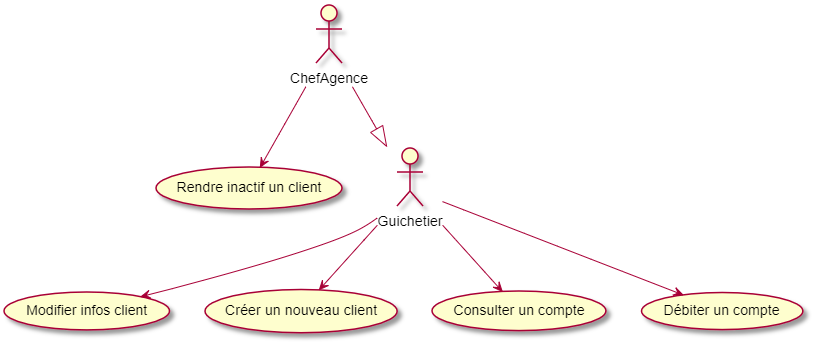

= CDCU Version 1
:toc:

== Contexte 

La banque DailyBank souhaite développer une application JAVA-Oracle de gestion des comptes clients pour remplacer plusieurs outils obsolètes. Ce développement s’inscrit dans le cadre de la restructuration de ses services bancaires et l’application sera déployée dans les 100 agences que compte son réseau. Nous travaillerons à partir d’une application existante « Daily Bank » qu’il faudra adapter aux nouveaux besoins de la banque.

== Description de l'application
L’application permet de gérer des comptes bancaires de dépôt pour des clients préalablement créés. Elle permet de débiter, créditer un compte soit par virement c’est-à-dire un échange d’argent entre deux comptes distincts mais domiciliés dans le réseau bancaire, soit par une personne physique se présentant devant un guichet.

== Objectif

L’application doit permettre de gérer des comptes bancaires de dépôt pour des clients préalablement créés. Elle devra permettre de débiter, créditer un compte soit par virement c’est-à-dire un échange d’argent entre deux comptes distincts mais domiciliés dans le réseau bancaire, soit par une personne physique se présentant devant un guichet.

== Analyse de l'existant (UC V0)

Il nous est fourni une application avec comme existant les fonctions principales.

En ce qui concerne le lancement de notre projet nous avions à notre disposition ce diagramme des cas d'utilisations suivant :

Le guichetier hérite du chef d'agence : il pourra ainsi rendre inactif un client en plus de ces propres fonctions et de l'accueil des clients.
            
== Version à implémenter (UC V1)     

Voici le diagramme des cas d'utilisation que l'on a élaboré pour le rendu de la version 1 : 

image::../V1/images/unknown.png[UC V1]
