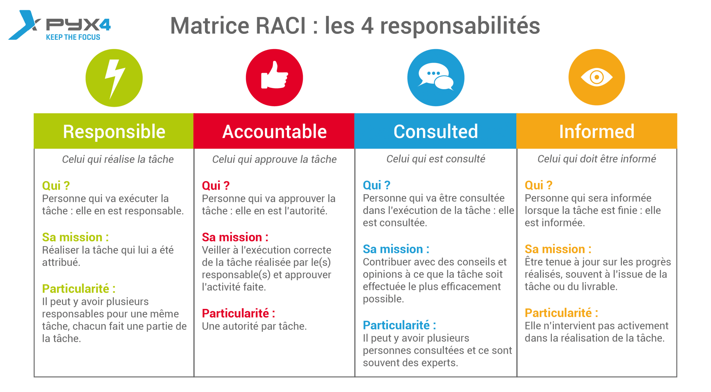

= Cahier de tests V1
:toc:

== Présentation du projet

=== Objectifs 

L’application doit permettre de gérer des comptes bancaires de dépôt pour des clients préalablement créés. 
Elle devra permettre de débiter, créditer un compte soit par virement c’est-à-dire un échange d’argent entre deux comptes distincts mais domiciliés dans le réseau bancaire, soit par une personne physique se présentant devant un guichet.

=== Responsabilités

Pour réussir un projet, il est primordial d’être bien organisé et de pouvoir déterminer les responsabilités de chacun au sein du projet. +
La réussite de ce projet repose donc sur une définition claire et précise des rôles et des responsabilités de chacun des acteurs.

Pour cela, on va utiliser la méthode RACI.

==== Qu’est-ce que la matrice RACI ?

R.A.C.I. est un acronyme qui signifie :
____
R - Responsible : les personnes chargées de réaliser la tâche +
A - Accountable : les autorités chargées de valider le travail +
C - Consulted : les personnes à consulter +
I - Informed : les personnes à informer +
____

Aussi appelée matrice des responsabilités ou RAM (Responsibility Assignment Matrix), la matrice RACI vous donne une vision simple et précise de qui fait quoi au sein du projet. Il s’agit d’un outil indispensable pour identifier clairement la répartition des rôles et des responsabilités de toute personne qui intervient sur le projet.

Plusieurs personnes peuvent travailler ensemble à la réalisation d’une même tâche, mais la responsabilité doit être attribuée à une seule et unique personne. C’est cette personne que l’on va contacter pour connaître l’avancement de la tâche. C’est elle qui doit s’assurer que la tâche sera effectuée en respectant le budget et les délais qui lui ont été alloués.

Ainsi, la matrice RACI permet de déterminer :
____
* qui sont les membres opérationnels du projet et leurs tâches respectives ;
* qui est l'unique décideur ;
* qui sont les personnes qui peuvent être sollicités pour des conseils ;
* qui sont les personnes qui doivent être informées des évolutions du projet.
____

==== La matrice RACI :

[%header,format=csv]
|===
Tâches,Victor,Mickael,Nicolas,Louis
*GPO - V0/V1*,---,---,---,---
Préparer le dépôt du groupe sout GIT,C,C,A,R
Créer Gantt V1,R,R,A,I
Créer / ordonnancer les tâches / issues du projet,R,R,R,R
Rédiger en Asciidoc le CDCU V1,C,C,R,I
Rédiger la documentation technique et la documentation utilisateur V0,I,C,C,R
Créer le cahier de TEST V1,R,A,I,I
Rédiger la documentation technique et la documentation utilisateur V1,I,C,I,R
*DEV V0/V1*,---,---,---,---
Gérer les employés, , , ,
Créditer ou débiter un compte,R,I,A,I
Créer un compte, , , ,
Effectuer un virement,A,R,C,I
Clôturer un compte, , , ,
|===

== Périmètre et environnement des tests

=== Cadre de tests

L'exécution de ces tests s'effectueront à travers le framework de test unitaire JUnit en Java 1.8 sur l'environnement de travail Eclipse. Cela permettra de s'assurer que le code répond toujours aux besoins même après d'éventuelles modifications.

=== Equipes concernées

Afin de mener à bien les actions à réaliser, seule une équipe de 4 personnes (voir README.adoc) est présente.
Toutefois, la répartition des tâches reste, pour le moment, encore incertaine.

== Liste des tests

Une liste de tests, comme son nom l'indique, permet de décrire les différentes actions à conduire afin de réaliser les futurs tests.
Ces listes de tests facilitent ainsi la compréhension et la clarté des actions à mener mais également de faciliter la qualification des problèmes rencontrés au cours de la réalisation d'une action et donc, d'une manière plus générale, de la gestion de celles-ci.

.Développement des cas d'utilisation de la V1

|===
|N° |Acteurs |Actions à réaliser |Attendus des actions sur l'application |Validité

|1
|Chef d'Agence
|Gérer les employés (guichetiers et lui-même)
|• Doit pouvoir observer les différents comptes ouverts à l'agence (y compris lui-même) à l'aide d'une option qui lui serait proposée ; +

 • Doit pouvoir observer les différentes modifications qui seraient apportées par un guichetier sur un compte ; +
 
 • Doit pouvoir gérer l'ensemble des comptes crées au sein de l'agence (virements, dépôts ou retraits) ; +
 
 • Ne doit pas pouvoir gérer un guichetier ayant un compte au sein d'une agence différente. +
 → _Soit le chef d'agence voit uniquement les différents comptes qui sont présents dans l'agence,_ +
 → _(Version non-optimisée) Soit le chef d'agence peut voir tous les comptes. Message d'erreur : "Veuillez choisir un compte au sein de votre agence bancaire." (dans une liste ou sous forme de pop-up)_
|

|2
.4+<.>|Guichetier
|Créditer ou débiter un compte
|Débiter : +
 • Doit pouvoir être affiché dans une liste des opérations effectuées (listview) ; +

 • Ne doit pas pouvoir être débité d'une somme négative. + 
 → _Message d'erreur : NumberFormatException si somme inférieur à  0, String de la somme en ROUGE et impossibilité de débiter cette somme;_ +

 • Ne doit pas pouvoir être débité d'une somme supérieure à un plafond éventuellement défini. + 
 → _Message d'erreur : "Dépassement du découvert!" (dans une liste ou sous forme de pop-up)_
 
 Créditer : +
  • Doit pouvoir être affiché dans une liste des opérations effectuées (listview) ; +

 • Ne doit pas pouvoir être crédité d'une somme négative. + 
 → _Message d'erreur : NumberFormatException si somme inférieur à 0, String de la somme en ROUGE et impossibilité de créditer cette somme;_ +

|

|3
|Créer un compte à partir d'informations complémentaires
|• Doit pouvoir être visible par le créateur du compte ainsi que le chef d'agence (proposée en tant qu'option pour celui-ci) ;

 • Ne doit pas renseigner des informations erronées (message possédant des caractères spéciaux ou ne respectant pas le type attendu). +
 → _Message d'erreur : "Veuillez vérifiez que vos informations renseignées soient valides." (dans une liste ou sous forme de pop-up) ;_ +
|

|4
|Effectuer un virement de compte à compte
|• Doit pouvoir être affiché en tant que message complet (virement, montant) dans une listview pour l'émetteur et le bénéficiaire ;
 
 • Ne doit pas pouvoir être crédité ou débité d'une somme négative. + 
 → _Erreur apparaissant sur l'interface du virement : les champs de texte changent de couleur, passant ainsi au rouge.;_ +

 • Ne doit pas pouvoir effectuer le virement d'une somme supérieure à un plafond éventuellement défini. + 
 → _Message d'erreur : "Dépassement du découvert !" accompagné des champs de texte également modifiés en rouge.;_
 
 • Ne doit pas pouvoir réaliser le virement vers un compte clôturé ou n'existant pas. +
 → _Changement de la requête SQL en ne prenant en considération que les comptes ouverts._
 
 • Ne doit pas pouvoir réaliser un virement vers lui-même (le même compte) +
 → _Condition vérifiant si le compte dans lequel nous réalisons l'opération figure parmi tous les comptes recherchés. Si c'est le cas, il est retiré pour la procédure du virement, dans le cas échéant, ce ne sera pas le cas._
|

|5
|Clôturer un compte
|• Doit pouvoir être affiché en tant que message dans une liste pour le guichetier et le chef d'agence ;

 • Ne doit plus être en interaction par un autre compte afin de réaliser une transaction quelconque, seul la consultation du compte sera possible, aucune autre action sera possible
 → _Le solde du compte est remis à zéro 
 
 
 • Ne doit pas pouvoir clôturer un compte déjà clôturé. +
 → _Le compte est toujours visible par le chef d'agence ainsi que le guichetier mais aucunes actions ne peuvent être faites mise à part consulter le compte
|
