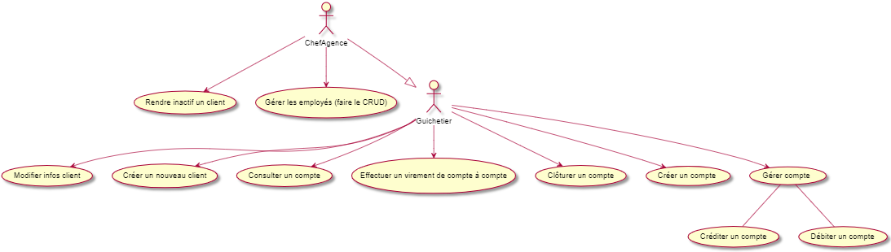
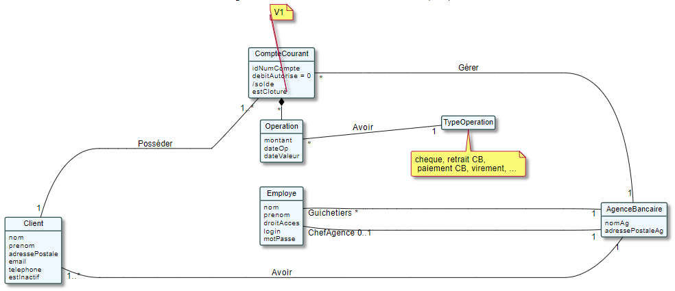

= Documentation Technique - V1
:toc:

== I - Présentation rapide de l'application

=== 1. Explications du use case global

Voici le use case général de la version 1 de l'application DailyBank :

==== 1.1 Types d'utilisateurs et spécificités

Tout comme dans la V0, deux types d'utilisateurs subsistent : le chef d'agence ainsi que les guichetiers.
En tant que chef d'agence, celui-ci possède des privilèges et des droits supplémentaires au sein de son agence bancaire, à comparer d'un simple employé (guichetier).

Pour justifier cela, bien que le chef d'agence pouvait, dans la V0, rendre inactif un client inscrit dans son agence bancaire, celui-ci peut en plus gérer ses employés. Cela n'aurait évidemment pas d'intérêts que cette action soit réciproque car la hiérarchie des rôles de chaque employé ne serait pas respectée.
Celui-ci, en logique, bénéficie de l'ensemble des actions que peuvent réaliser les guichetiers.

Pour un guichetier, en plus de pouvoir modifier les informations d'un client ou en créer un nouveau, de consulter un compte ou de pouvoir le débiter, étant des fonctionnalités déjà présentes dans la V0, celui-ci pourra profiter de possibilités supplémentaires telles que de créer un nouveau compte, de créditer ou d'effectuer un virement de compte à compte ou encore de pouvoir clôturer le compte sélectionné.

Ces actions ne seront ainsi, possibles sans traiter les différentes problématiques liées à ces utilisations.

=== 2. Explications du diagramme de classe des données globales

==== 2.1 Fonctionnalités du chef d'agence

==== 2.2 Fonctionnalités du guichetier

== II - Architecture

=== 1. Architecture générale

Lorsqu'un employé vient à utiliser l'application "DailyBank", celle-ci n'est en réalité pas complexe à son utilisation. Elle reste relativement claire, facile à comprendre bien que certaines règles (règle des trois clics par exemple) ne soient pas respectées afin de trouver toutes les informations de manière rapide et simplement. Pour autant, celle-ci possède une architecture relativement aisée à comprendre étant donné qu'elle est construite sur un fonctionnement centralisé.

==== 1.1 Poste client

Concrètement, cela se résume à ce que l'application puisse être utilisée de n'importe quel employé, depuis n'importe quel poste de travail. Ainsi, chaque modifications ou ajouts de données effectuées, depuis un poste de travail au sein d'une agence bancaire inclue dans l'application, seront directement appliquées et reliées à la base de données de celle-ci. Ainsi, chaque poste de travail est une machine dédiée à un employé de l'agence bancaire.

==== 1.2 Serveurs

L'application possède ainsi une base de données propre à ses caractéristiques. Elle permet de conserver l'ensemble des informations relatives à une agence bancaire telles que : +
• Les employés ; +
• Les clients ; +
• Les comptes des clients ou encore +
• Les opérations effectuées depuis un compte.

=== 2. Ressources externes et rôles

=== 3. Structuration en packages de l'application

La structuration de l'application est répartie en plusieurs packages que voici : 

[source]
----
├── application
    │   ├── application.control
    │   ├── application.tools
    │   └── application.view
    └── model
        ├── model.data
        └── model.orm
            └── model.orm.exception
----

=== 4. Éléments à connaître

Comme vous pouvez l'observer, le code de l'application est fourni dans 4 packages principaux : 
• control ; +
• tools ; +
• view ; +
• model ; +

Ces packages font ainsi référence à un principe de structuration que l'application ici présente et que les applications web en règle générale : le principe de MVC (Model-View-Controller).

Le MVC (de son nom français _modèle-vue-contrôleur_) est le nom d'une méthodologie ou d'un motif de conception visant à faire le lien entre l'interface utilisateur et les modèles de données sous-jacents. Elle est notamment utile pour permettre de créer une application web afin de bien gérer la structuration d’un projet en trois parties ou encore pour la réutilisation du code objet, qui permet de réduire le temps nécessaire au développement d'applications dotées d'une interface utilisateur.

==== 4.1 Spécificités

==== 4.2 Éléments nécessaires à la mise en oeuvre du développement

== III - Explications des fonctionnalités

=== 1. Guichetier

==== 1.1 Modifier les informations d'un client

===== Partie du use case conforme

image::/V1/images/modifinfoclient.PNG[Modifier info client]

===== Partie du diagramme de classe conforme

===== Principales fonctionnalités

===== Classes impliquées à l'implémentation de la fonction

===== Éléments à connaître / spécificités

===== Extraits de code commentés pour des points importants

==== 1.2 Créer un nouveau client

===== Partie du use case conforme

image::/V1/images/creernewclient.PNG[Creer new client]

===== Partie du diagramme de classe conforme

===== Principales fonctionnalités

===== Classes impliquées à l'implémentation de la fonction

===== Éléments à connaître / spécificités

===== Extraits de code commentés pour des points importants

==== 1.3 Créer un nouveau compte 

===== Partie du use case conforme

image::/V1/images/creercompte.PNG[Creer new compte]

===== Partie du diagramme de classe conforme

===== Principales fonctionnalités

===== Classes impliquées à l'implémentation de la fonction

===== Éléments à connaître / spécificités

===== Extraits de code commentés pour des points importants

==== 1.4 Clôturer un compte

===== Partie du use case conforme

image::/V1/images/cloturercompte.PNG[Clôturer compte]

===== Partie du diagramme de classe conforme

===== Principales fonctionnalités

===== Classes impliquées à l'implémentation de la fonction

===== Éléments à connaître / spécificités

===== Extraits de code commentés pour des points importants

==== 1.5 Consulter un compte

===== Partie du use case conforme

image::/V1/images/consultercompte.PNG[Consulter compte]

===== Partie du diagramme de classe conforme

===== Principales fonctionnalités

===== Classes impliquées à l'implémentation de la fonction

===== Éléments à connaître / spécificités

===== Extraits de code commentés pour des points importants

==== 1.6 Débiter un compte (BD)

===== Partie du use case conforme

image::/V1/images/créditerdébiter.PNG[Créditer compte]

===== Partie du diagramme de classe conforme

===== Principales fonctionnalités

===== Classes impliquées à l'implémentation de la fonction

===== Éléments à connaître / spécificités

===== Extraits de code commentés pour des points importants

==== 1.7 Créditer un compte (BD)

===== Partie du use case conforme

image::/V1/images/créditerdébiter.PNG[Débiter compte]

===== Partie du diagramme de classe conforme

===== Principales fonctionnalités

===== Classes impliquées à l'implémentation de la fonction

===== Éléments à connaître / spécificités

===== Extraits de code commentés pour des points importants

==== 1.8 Effectuer un virement de compte à compte

Le virement consiste à, depuis un compte sélectionné, transférer une somme d'argent quelconque à destination d'un compte pouvant être d'un autre client ou de soi-même. Évidemment, il est inutile voir contradictoire d'effectuer un virement vers le même compte sélectionné et il en va de même pour un montant invalide (inférieur à 0 ou ne respectant pas le type attendu). 

===== Partie du use case conforme

image::/V1/images/virementcompte.PNG[Virement compte]

===== Partie du diagramme de classe conforme

===== Principales fonctionnalités

Les principales fonctionnalités ont été introduites de manière brève dans l'introduction de cette opération. Pour plus de détails, veuillez vous référer à la https://github.com/IUT-Blagnac/sae2022-bank-4a2/blob/main/V1/Documentation%20Utilisateur%20V1.adoc[_documentation utilisateur_].

===== Classes impliquées à l'implémentation de la fonction

Pour l'implémentation de cette action, plusieurs classes ont été impliquées :

*Côté application.tools :* +
• _CategorieOperation.java_ +
• _ConstantesIHM.java_

*Côté application.control :* +
• _OperationManagement.java_ +
• _OperationEditorPane.java_

*Côté application.view :* +
• _OperationManagementController.java_ +
• _OperationEditorPaneController.java_

*Côté model.orm :* +
• _CompteCourant.java_

*Côté model.orm / model.orm.exception :* +
• _AccessCompteCourant.java_ +
• _DatabaseConnexionException.java_

===== Éléments à connaître / spécificités

L'une des fonctions importantes pour implémenter cette action est la fonction getTousLesComptes() dans la classe AccessCompteCourant.java qui permet de rechercher l'ensemble des comptes de tous les clients (qu'ils soient dans une même agence ou non) pour effectuer cette opération.

===== Extraits de code commentés pour des points importants

image::/V1/images/bouclevirement.PNG[Boucle virement]

Cette condition est relativement importante pour mentionner le fait qu'un virement ne peut pas être effectué sur le compte étant sélectionné. Sans cette condition, aucune erreur ne serait à constater car le montant dépensé correspondait au montant reçu mais cela ne fait aucun sens.

=== 2. Chef d'agence

==== 2.1 Rendre inactif un client 

===== Partie du use case conforme

image::/V1/images/inactifclient.PNG[Client inactif]

===== Partie du diagramme de classe conforme

===== Principales fonctionnalités

===== Classes impliquées à l'implémentation de la fonction

===== Éléments à connaître / spécificités

===== Extraits de code commentés pour des points importants

==== 2.2 Gérer les employés (CRUD)

===== Partie du use case conforme

image::/V1/images/gereremployes.PNG[Gérer employés]

===== Partie du diagramme de classe conforme

===== Principales fonctionnalités

===== Classes impliquées à l'implémentation de la fonction

===== Éléments à connaître / spécificités

===== Extraits de code commentés pour des points importants

==== Éléments nécessaires à la mise en oeuvre du développement

Les tâches d'administration effectuables sur les clients doivent respecter certaines conditions.

=== Chef d'Agence
- Le chef d'agence peut rendre inactif un client
* Si le client est inactif depuis plus de un an.
* Si le compte rencontre un problème technique.
* Si le client a subi un vol.

Il est également la structure mère du guichetier.

=== Guichetier
Ce dernier hérite du chef d'agence, il peut ainsi également rendre inactif un client.

.Le guichetier peut effectuer quatres actions :

['upperroman']
. Modifier les informations d'un client
* **Attention** : Le numéro du client ne doit pas être modifiable !
* Nom du client
* Adresse du client
* Numéro de téléphone du client
* ...

. Créer un nouveau client
* Le numéro de client doit être inexistant dans la base de données.
* Certaines informations sont exigées : Nom, Prénom, Adresse

. Consulter un compte
* Doit posséder le numéro de client

. Débiter un compte
* Sur la demande d'un client seulement.
* Doit posséder le numéro de client
